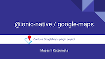
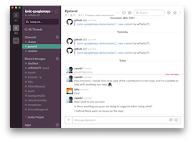
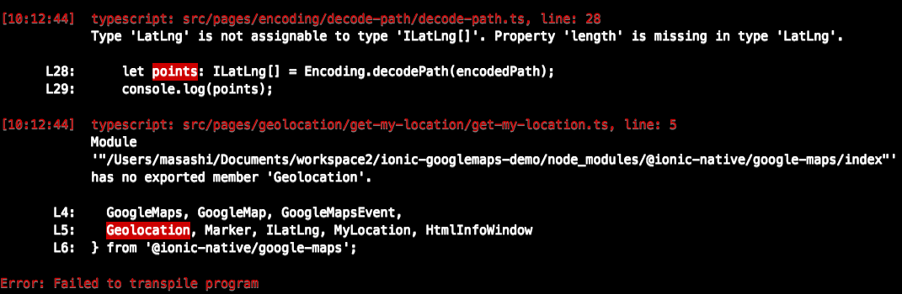
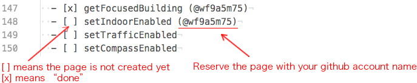

Contributing to ionic-googlemaps-demo
---------------------------------------

Thank you for jumping on to the ionic-googlemaps-demo project.
The goal of this repo is to create demo app for the [@ionic-native/google-maps](https://ionicframework.com/docs/native/google-maps/).
Before tackling to this repo, I recommend to read the slides of the \@ionic-native/google-maps plugin.

**Overview of \@ionic-native/google-maps plugin**

https://docs.google.com/presentation/d/1zlkmoSY4AzDJc_P4IqWLnzct41IqHyzGkLeyhlAxMDE/present

<a href="https://docs.google.com/presentation/d/1zlkmoSY4AzDJc_P4IqWLnzct41IqHyzGkLeyhlAxMDE/present">

</a>


# Overview

There is already an example app for the cordova-plugin-googlemaps.
However this example app is created with **pure JavaScript, not for \@ionic-native/google-maps**

https://github.com/mapsplugin/v2.0-demo


This repo of goal is to reproduce this example app with \@ionic-native/google-maps


# How to contribute?

### 1. Join to the slack group, and say `hi!`


[slack invitation link](https://join.slack.com/t/ionic-googlemaps/shared_invite/enQtMjQxODYzMDg3NTQzLWNhNTc5YzIzOGYxMDE3NmFhMGFiYmU2YWJkNThhNTYyMzdmYTg5ZDQ3YTRmYjc4OTVlZDU0NzU3ZGIzNWZiOTM)

### 2. Tell your github account to admin(@wf9a5m75)

### 3. Set up the environment

#### 3.1 Build the `@ionic-native/google-maps` dev version

In order to develop new version, sometimes this repo includes new features that are not released yet.

If you try to build this repo with the `@ionic-native/google-maps` released version, you might see something like this.



In order to prevent this error, you need to build the dev version of the `@ionic-native/google-maps` plugin.

```
$> git clone https://github.com/wf9a5m75/ionic-native

$> cd ionic-native

$> node -v
v9.3.0  <--- important! I recommend you use nvm(https://github.com/creationix/nvm)

$> npm run build
...
Building plugin: google-maps
....
Done processing plugins!

```


#### 3.2 Install the built dev version of the `@ionic-native/google-maps`


```
$> git clone https://github.com/wf9a5m75/ionic-googlemaps-demo

$> cd ionic-googlemaps-demo

//--------------------------------------
// For just in case, remove old plugins
//--------------------------------------
$> npm uninstall @ionic-native/core @ionic-native/google-maps
$> ionic cordova plugin rm cordova-plugin-googlemaps

//---------------------------------------------------
// Install the @ionic-native/google-maps dev plugin
//---------------------------------------------------
$> npm install (path to)/ionic-native/dist/\@ionic-native/core
$> npm install (path to)/ionic-native/dist/\@ionic-native/google-maps


//----------------------------------------------
// Install the cordova-plugin-googlemaps plugin
//----------------------------------------------
$> ionic cordova plugin add https://github.com/mapsplugin/cordova-plugin-googlemaps#multiple_maps \
 --variable API_KEY_FOR_IOS="(your api key)" \
 --variable API_KEY_FOR_ANDROID="(your api key)"

// Confirm
$> ionic cordova run android
```

### 4. Reserve the page you want to create.

In order to prevent conflicting with other members, please write your github account name to right side of the page list in the `README.md`.



Then commit & push it at once.

```
$> git add README.md

$> git commit -m "Reserve some pages for @wf9a5m75"

$> git push
```

### 5. Create pages

Let's create a page for this repo. For example, if you want to create an example page for [map.setIndoorEnabled()](https://github.com/mapsplugin/cordova-plugin-googlemaps-doc/blob/master/v2.0.0/class/Map/setIndoorEnabled/README.md).

#### 5.1 Generate a page

First of all, you need to create a page folder.
At the top directory of this repo:

```
$> ionic generate page SetIndoorEnabledPage
[OK] Generated a page named SetIndoorEnabledPage!
```

Then move the `set-indoor-enabled` folder into the `pages/map` directory.

```
$> mv set-indoor-enabled map/
```


#### 5.2 Create example code

The source code of the pure JS version is below.

https://github.com/mapsplugin/v2.0-demo/blob/master/www/Map/setIndoorEnabled.html
```html
<div id="contentView">
    <div id="contentsFrame">
        <section class="demo">

            <p>Set true if you want to show the indoor map.</p>
            <div class="map" id="map_canvas">
                <span class="smallPanel"><button>current: map.indoorEnable = false</button></span>
            </div>
            <pre class="prettyprint">var div = document.getElementById("map_canvas");
var map = plugin.google.maps.Map.getMap(div, {
  camera: {
    target: {
      lat: 37.422375,
      lng: -122.084207
    },
    zoom: 17
  },
  controls: {
    indoorPicker: true
  }
});
map.one(plugin.google.maps.event.MAP_READY, function() {

  var isEnabled = false;
  var button = div.getElementsByTagName('button')[0];
  button.addEventListener('click', function() {
    isEnabled = !isEnabled;
    map.setIndoorEnabled(isEnabled);
    button.innerHTML = "current: map.indoorEnable = " + isEnabled;
  });

});
</pre>
    </section>
</div>
```

Since the JS version executes the code of `<pre>` tag, the source code is written in the HTML file.
However in ionic, you need to write the code in `set-indoor-enabled.ts` file.

So, create your code into `set-indoor-enabled.ts` file like this:

**set-indoor-enabled.ts**

```TypeScript
import { Component } from '@angular/core';
import { IonicPage } from 'ionic-angular';
import { GoogleMaps, GoogleMap, GoogleMapsEvent } from '@ionic-native/google-maps';

@IonicPage()
@Component({
  selector: 'page-set-indoor-enabled',
  templateUrl: 'set-indoor-enabled.html',
})
export class SetIndoorEnabledPage {
  map: GoogleMap;
  toggleButton: any;

  constructor() {}

  ionViewDidLoad() {
    this.loadMap();
  }
  loadMap() {
    this.map = GoogleMaps.create('map_canvas', {
      camera: {
        target: {
          lat: 37.422375,
          lng: -122.084207
        },
        zoom: 18
      },
      controls: {
        indoorPicker: true
      }
    });

    // Wait the MAP_READY before using any methods.
    this.map.one(GoogleMapsEvent.MAP_READY)
      .then(() => {
        console.log('Map is ready!');
      });
  }

  onToggleChanged() {
    this.map.setIndoorEnabled(this.toggleButton);
  }

}
```

**set-indoor-enabled.html**

```html
<ion-header>

  <ion-navbar>
    <ion-title>map.setIndoorEnabled()</ion-title>
  </ion-navbar>

</ion-header>


<ion-content padding>
  <section class="demo">

    <div class="map" id="map_canvas">
      <div style="position:absolute;width:50px;height:30px">
        <ion-toggle
              value="locationButton" checked="true"
              style="background-color:rgba(125,125,125,0.5);"
              [(ngModel)]="toggleButton" (ionChange)="onToggleChanged();"></ion-toggle>
      </div>
    </div>
    <textarea class="prettyprint" style="height:280px" readonly="readonly"></textarea>
  </section>

</ion-content>
```

#### 5.3 Embed your code into the html file

In order to help to understand how to write the code without seeing this repo,
we embed the code of main part into `<textarea>`.

Please copy of your code into `<textarea>`.

```html
<ion-header>

  <ion-navbar>
    <ion-title>map.setIndoorEnabled()</ion-title>
  </ion-navbar>

</ion-header>


<ion-content padding>
  <section class="demo">

    <div class="map" id="map_canvas">
      <div style="position:absolute;width:50px;height:30px">
        <ion-toggle
              value="locationButton" checked="true"
              style="background-color:rgba(125,125,125,0.5);"
              [(ngModel)]="toggleButton" (ionChange)="onToggleChanged();"></ion-toggle>
      </div>
    </div>
    <textarea class="prettyprint" style="height:280px" readonly="readonly">
class SetIndoorEnabledPage {
  map: GoogleMap;
  toggleButton: any;

  constructor() {}

  ionViewDidLoad() {
    this.loadMap();
  }
  loadMap() {
    this.map = GoogleMaps.create('map_canvas', {
      camera: {
        target: {
          lat: 37.422375,
          lng: -122.084207
        },
        zoom: 18
      },
      controls: {
        indoorPicker: true
      }
    });

    // Wait the MAP_READY before using any methods.
    this.map.one(GoogleMapsEvent.MAP_READY)
      .then(() => {
        console.log('Map is ready!');
      });
  }

  onToggleChanged() {
    this.map.setIndoorEnabled(this.toggleButton);
  }

}
</textarea>
</section>
</ion-content>
```

#### 5.4 please confirm your code before push it

```
$> ionic cordova run android

$> ionic cordova run ios
```


#### 5.5 Mark as `done` in the README.md

After finishing your work, please mark `- [x] setIndoorEnabled (@wf9a5m75)`


#### 5.6 commit & push them

Do not include your `package.json`, `package-lock.json` and `config.xml`

```
$> git add pages/map/set-indoor-enabled/

$> git commit -m "Add example: map.setIndoorEnabled()"

$> git push
```

That's it!

### 6. Problems or questions?

Chat at the slack channel.
